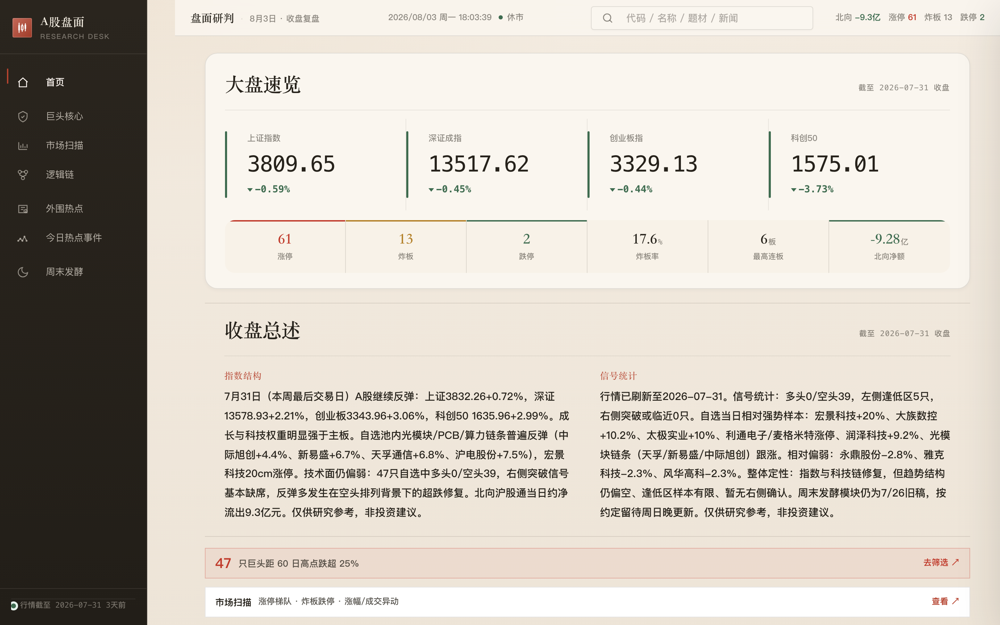
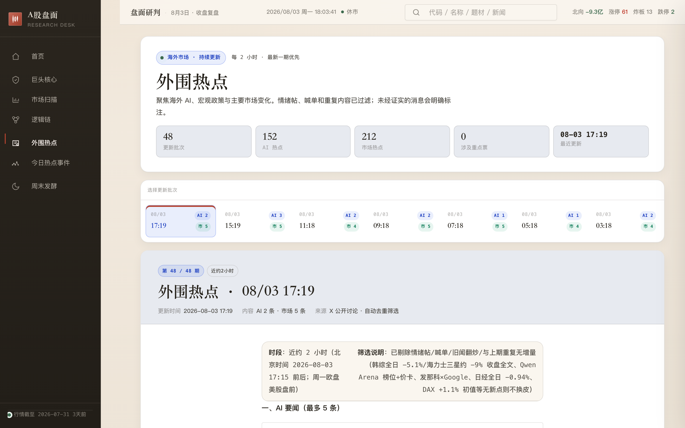

# A 股盘面研究看板

**本地优先、无广告的 A 股复盘 / 研究看板** —— 暖色研究台视觉（深墨侧栏 · 纸感主区），覆盖大盘速览、自选信号、市场扫描，以及逻辑链、今日热点、外围热点（每日 23:00）和周末发酵。

> 数据由脚本测算或 AI 整理，仅供研究参考，不构成投资建议。

[](https://13103205397a-a11y.github.io/stock-dashboard/)
[](#mac-app)
[](#)

<p align="center">
  
</p>

<p align="center">
  
</p>

## 一分钟上手

| 方式 | 怎么开 |
|---|---|
| **在线 Demo（最快）** | 打开 [GitHub Pages](https://13103205397a-a11y.github.io/stock-dashboard/) |
| **本机网页** | 仓库里双击 `index.html`，或运行 `python3 app_server.py` 后访问 http://localhost:8787/index.html |
| **Mac App** | 构建：`bash app/build.sh`，然后打开 `股市看板.app`（菜单栏可点开最新「外围热点」） |

深链接：`#home` · `#watch` · `#market` · `#logic` · `#xbrief` · `#kimi` · `#events` · `#weekend`

搜索：`/` 或 `Ctrl/Cmd+K`

## 能看什么

- **首页**：指数、涨停/炸板等盘面摘要 + 收盘总述（宽屏左右分栏）
- **巨头核心**：自选叙事与技术信号
- **市场扫描**：涨停梯队、炸板、涨跌异动（只读）
- **逻辑链 / 今日热点 / 周末发酵**：事件到产业映射与研究文（导读铺满、卡片分栏）
- **外围热点**：海外 AI + 宏观/市场硬信息简报（每日 23:00 汇总当天内容，有新增才发布）；Mac 菜单栏可点开最新一期
- **每日复盘**：Kimi Code 本机 HTML 复盘只读接入；报告内容只在本地看板显示，不上传公开站点

## 为什么开源这个

- **本地优先**：数据在你机器上跑，不靠商业终端广告墙
- **研究向**：偏复盘与叙事整理，不是交易下单软件
- **可静态部署**：一套页面既能本机开，也能挂 GitHub Pages
- **暖色研究台**：深墨侧栏 + 纸感主区 + 赤陶点缀，编辑式排版，红涨绿跌

---

## 开发者文档

下面是模块、刷新与质量门禁说明（贡献 / 改代码时看这里）。

### 活跃模块

`active_modules.json` 是模块生命周期的唯一来源。公开构建、数据契约、新鲜度门禁、Agent 交付配置和部署后资源探针都读取它，删除模块时不再需要分别维护多份硬编码列表。

| 文件 | 全局变量 | 用途 |
|---|---|---|
| `data.js` | `window.STOCKS` | 自选股叙事、信号、消息和详情 |
| `meta.js` | `window.META` | 行情时点、指数快照和市场摘要 |
| `market.js` | `window.MARKET` | 首页共享环境 +「市场扫描」页（涨停梯队/异动只读） |
| `logic.js` | `window.LOGIC` | 事件到产业和标的的逻辑链 |
| `events.js` | `window.EVENTS` | 今日热点事件 |
| `xbriefs.js` | `window.XBRIEFS` | 外围热点批次简报 |
| `weekend.js` | `window.WEEKEND` | 周末发酵 |
| `kimi_review.js` | `window.KIMI_REVIEW` | 公开站点安全空快照；本地看板从 Kimi HTML 只读加载 |

持仓、自选筛选、产业雷达、产业链涨价、资金流向、新闻聚合、今日热榜等已退休模块不再进入前端、刷新计划、公开构建或线上探针。

`public_files.json` 只维护前端核心资源，并通过 `activeModules` 指向上述清单。`scripts/build_site.py` 合并两者生成确定性的 Pages 产物：

```bash
python3 scripts/build_site.py _site
python3 scripts/build_site.py --list-files
```

`--list-files` 与 Pages 部署后的资源探针使用同一份结果，避免构建和探针口径漂移。

### 数据刷新

行情共享数据由以下脚本维护：

| 脚本 | 写入 |
|---|---|
| `scripts/fetch_klines_tf.py` | `scripts/raw/<code>.json` |
| `scripts/fetch_signals.js` | `data.js` 的技术信号、`meta.js` 的指数与统计 |
| `scripts/fetch_news.py` | `data.js` 的个股新闻与公告 |
| `scripts/fetch_enhanced.py` | `data.js` 的资金、研报和估值 |
| `scripts/fetch_market.py` | `market.js` |
| `scripts/push_xbrief.py` | `xbriefs.js` |
| `scripts/fetch_weekend.py` | `weekend.js` |

统一刷新计划只保留仍服务活跃模块的步骤：

```bash
python3 scripts/run_refresh.py --list
python3 scripts/run_refresh.py
```

刷新结束会执行内容清理、数据契约和新鲜度门禁：

```bash
python3 scripts/sanitize_ai_content.py
node scripts/validate_data.js
node scripts/check_freshness.js --strict
```

日期校验会拒绝不存在的日历日期和未来日期，防止错误时间戳被误判为“新鲜”。

### Grok X 每日 23:00 后台任务

`scripts/run_grok_xbrief.py` 每次只运行一轮，Grok 仅允许使用内置 X 搜索，命令执行、文件读写、MCP、网页搜索和 scheduler 工具均被禁用。脚本从 X status ID 解码真实发布时间，按北京时间窗口去重；没有新推文就不写 `xbriefs.js`、不推送 GitHub，但仍执行行情刷新。

macOS 通过 `launchd/com.stockdashboard.grok-xbrief.plist` 每天本机时间 23:00 唤醒一次，汇总近 24 小时内容；任务完成后退出，不要求终端窗口常驻。当前状态与日志：

```bash
python3 scripts/run_grok_xbrief.py --status
launchctl print gui/$(id -u)/com.stockdashboard.grok-xbrief
tail -f ~/Library/Logs/StockDashboard/grok-xbrief.log
```

只读采集规则在 `agent/xbrief-collector.md`；完整人工说明在 `agent/xbrief.md`。

### Mac App

```bash
bash app/build.sh
open "股市看板.app"
```

菜单栏显示最新外围热点时间；点击弹出简报正文。本地 API：`GET /api/xbrief/latest`。

本地服务还会每 30 秒检查数据版本，检测到行情或研究文件更新后自动刷新页面；Kimi 复盘接口为 `GET /api/kimi-review/latest`，默认扫描 `~/Desktop/Claude复盘/` 和 Kimi workspace。

### Agent 研究模块（逻辑链 / 热点 / 周末）

这三类内容**不再由 Hermes 定时任务生成**。统一按 `agent/` 目录说明书，由你指定的 Agent（Cursor / Claude Code / Kimi Code 等）盘后或周日执行，直接写入：

| 模块 | 说明书 | 数据文件 |
|---|---|---|
| 逻辑链 | `agent/logic-chain.md` | `logic.js` |
| 今日热点事件 | `agent/events-analysis.md` | `events.js` |
| 周末发酵 | `agent/weekend_ferment.md` | `weekend.js` |

写入后本地打开确认，再按需提交推送。行情刷新仍走：

```bash
python3 scripts/run_refresh.py
```

历史脚本 `scripts/sync_hermes_dashboard.py` / `fetch_hermes_module.py` 仅保留兼容，默认日常流程不再调用。

### 质量门禁

```bash
npm ci
npm test
npm run test:e2e
python3 scripts/build_site.py _site
```

- `quality.yml` 在每次推送和 Pull Request 中执行语法检查、数据契约、新鲜度、单元/集成测试、桌面与手机浏览器 E2E；另在 macOS runner 上执行 `swiftc -typecheck app/main.swift`。
- `pages.yml` 在上传和部署前重新执行完整单元测试和浏览器 E2E。任何 E2E 失败都会阻止部署。
- 部署成功后，Pages 使用 `build_site.py --list-files` 探测全部实际公开文件。
- `refresh-signals.yml` 只生成并提交 `data.js`、`meta.js` 和 `market.js`，不会改写 Agent 研究模块文件。
- `ai-stale-watch.yml` 根据活跃模块清单巡检外围热点、逻辑链、今日热点事件和周末发酵。历史 `review` 字段仅用于现有卡片展示，不再对应生成任务或新鲜度门禁。

### 关键文件

| 文件 | 作用 |
|---|---|
| `index.html` / `app.js` / `app_ai_modules.js` | 页面结构、交互和研究模块渲染 |
| `styles.css` / `design-system.css` / `claude-theme.css` / `warm-desk.css` | 样式层：基础 → 设计系统 → 暖色主题 → 研究台版式覆盖 |
| `active_modules.json` | 活跃模块、数据契约、新鲜度和 Agent 交付配置 |
| `public_files.json` | 公开前端核心资源 |
| `scripts/build_site.py` | 确定性公开构建与探针清单 |
| `scripts/validate_data.js` | 活跃模块结构、引用、日期和内容校验 |
| `scripts/check_freshness.js` | 按北京时间及工作日计算的新鲜度门禁 |
| `scripts/refresh_plan.json` | 本地与 Mac App 共用的活跃刷新步骤 |
| `scripts/run_grok_xbrief.py` | Grok 只读 X 观察、去重、受控发布与行情刷新 |
| `launchd/com.stockdashboard.grok-xbrief.plist` | macOS 每日 23:00、跑完即退出的后台任务 |
| `scripts/sync_hermes_dashboard.py` | 旧 Hermes 同步器（兼容保留，默认不跑） |

### 增删模块

1. 在 `active_modules.json` 增删模块及其契约、新鲜度规则。
2. 在 `index.html` 增删相应数据脚本和导航入口。
3. 在渲染代码中增加或删除视图。
4. 更新 `agent/` 说明书或刷新计划。
5. 运行 `npm test && npm run test:e2e && python3 scripts/build_site.py _site`。

公开构建、验证和线上探针会自动随活跃清单更新。
